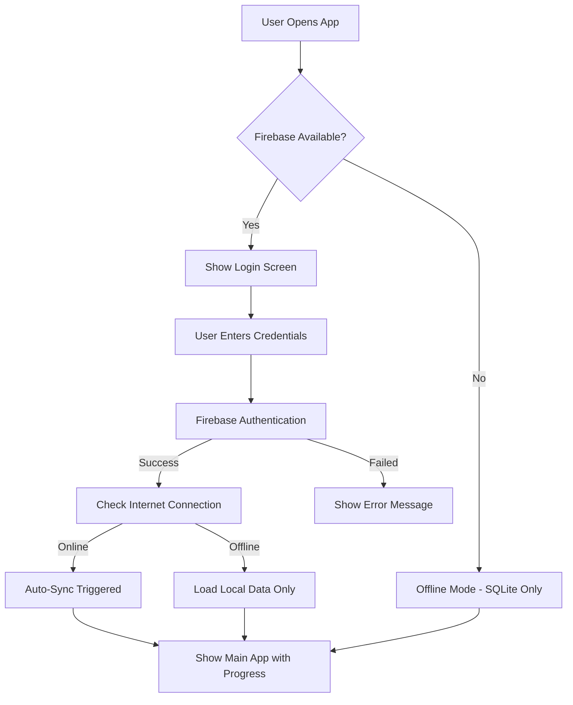
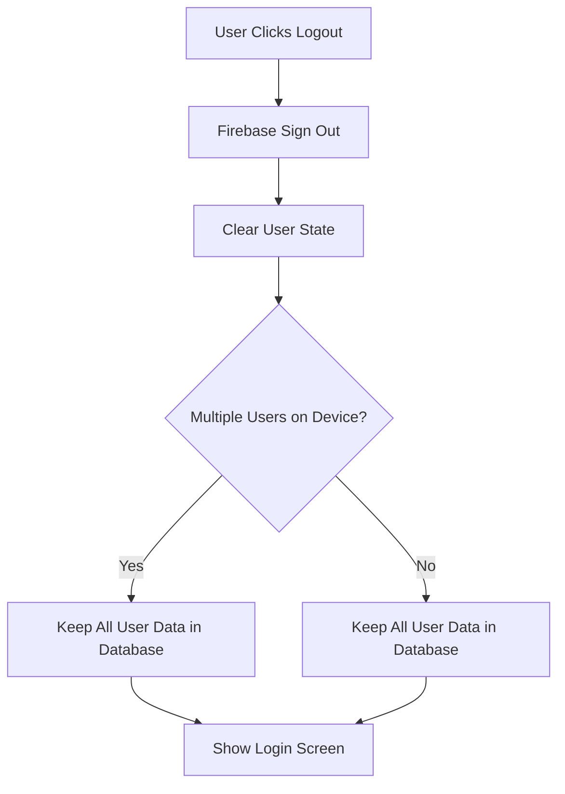
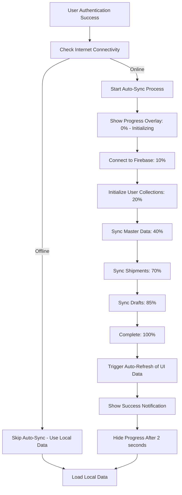

# 🔄 Invoice Generator - Sync & Authentication Complete Guide

## 📚 Table of Contents
- [Overview](#overview)
- [Authentication System](#authentication-system)
- [Database Architecture](#database-architecture)
- [Auto-Sync System](#auto-sync-system)
- [Manual Sync Operations](#manual-sync-operations)
- [Firebase Structure](#firebase-structure)
- [SQLite Local Database](#sqlite-local-database)
- [Multi-User Support](#multi-user-support)
- [Troubleshooting](#troubleshooting)
- [Code Examples](#code-examples)

---

## 🎯 Overview

The Invoice Generator app implements a sophisticated dual-storage system with automatic and manual synchronization capabilities. The app supports both online and offline modes, with seamless data synchronization between local SQLite database and Firebase Firestore.

### Key Features:
- ✅ **Firebase Authentication** with email/password
- ✅ **Auto-sync on login** when device is online
- ✅ **Auto-refresh UI** after sync completion
- ✅ **Manual sync** operations with progress tracking
- ✅ **Multi-user data isolation** on same device
- ✅ **Offline-first architecture** with local SQLite
- ✅ **Real-time sync progress** with detailed status updates
- ✅ **Cross-device synchronization** for authenticated users
- ✅ **Persistent theme preferences** across app restarts

---

## 🔐 Authentication System

### Login Process


### Login Implementation
**File:** `lib/providers/auth_provider.dart`

```dart
// Login method with auto-sync integration
Future<void> signInWithEmailAndPassword(String email, String password) async {
  if (!_isFirebaseAvailable) {
    throw Exception('Authentication not available offline');
  }

  _isLoading = true;
  _error = null;
  notifyListeners();

  try {
    await _auth!.signInWithEmailAndPassword(email: email, password: password);
    // Auto-sync will be triggered in _onAuthStateChanged
  } on FirebaseAuthException catch (e) {
    _error = _getErrorMessage(e);
    throw Exception(_error);
  } finally {
    _isLoading = false;
    notifyListeners();
  }
}
```

### Logout Process


**Key Point:** Logout does NOT clear any local data. All users' data remains in the local database for future logins.

---

## 🗄️ Database Architecture

### Dual Storage System
The app uses a **local-first** approach with cloud backup:

1. **Primary Storage:** SQLite (Local)
2. **Backup/Sync Storage:** Firebase Firestore (Cloud)
3. **Data Flow:** Local ↔ Cloud (Bidirectional sync)

### Database Version & Naming
- **Database Name:** `invoice.db`
- **Database Version:** `1` (simplified, no upgrade logic needed)
- **Location:** Device app data directory

---

## 🔄 Auto-Sync System

### Auto-Sync Triggers
Auto-sync happens **automatically** in these scenarios:

1. **Every Login** (when online) - Not just fresh installs
2. **User switches** (when different user logs in)
3. **App restart** with existing authentication

### Auto-Refresh After Sync

#### Problem Solved
**Issue:** After sync completes successfully, data was updated in the database but UI still showed old data until manual refresh.

**Solution:** Implemented automatic UI refresh when sync completion is detected.

#### Implementation
**File:** `lib/screens/invoice_list_screen.dart`

```dart
// InvoiceListScreen wrapped with Consumer to listen for sync completion
@override
Widget build(BuildContext context) {
  return Consumer<AuthProvider>(
    builder: (context, authProvider, child) {
      // Check if sync just completed and auto-refresh data
      if (authProvider.syncJustCompleted) {
        WidgetsBinding.instance.addPostFrameCallback((_) {
          _handleSyncCompletion(authProvider);
        });
      }
      
      return Scaffold(/* ... */);
    },
  );
}

// Auto-refresh handler
void _handleSyncCompletion(AuthProvider authProvider) async {
  print('🔄 AUTO-REFRESH: Sync completed, refreshing invoice data...');
  
  // Clear the sync completion flag
  authProvider.clearSyncCompletedFlag();
  
  // Refresh the data
  await _refreshInvoices();
  
  // Show success notification
  ScaffoldMessenger.of(context).showSnackBar(
    SnackBar(
      content: Row(
        children: [
          Icon(Icons.cloud_done, color: Colors.white),
          Text('Data synchronized successfully'),
        ],
      ),
      backgroundColor: Colors.green,
    ),
  );
}
```

#### User Experience Flow
1. **User logs in** → Auto-sync starts with progress overlay
2. **Sync progress** → 0% → 10% → 20% → ... → 100%
3. **Sync completes** → `syncJustCompleted` flag set to true
4. **UI detects completion** → Automatically calls `_refreshInvoices()`
5. **Data refreshed** → New/updated invoices appear immediately
6. **Success notification** → "Data synchronized successfully" shown
7. **Flag cleared** → Ready for next sync cycle

### Auto-Sync Flow


### Auto-Sync Implementation
**File:** `lib/providers/auth_provider.dart`

```dart
// Auto-sync trigger on authentication
void _onAuthStateChanged(User? user) async {
  final previousUserId = _user?.uid;
  final newUserId = user?.uid;

  // NO DATA CLEARING - Keep data for all users separately
  if (previousUserId != newUserId && previousUserId != null) {
    _logger.i('User switched from $previousUserId to ${newUserId ?? 'logout'}');
  }

  _user = user;
  DatabaseService().setCurrentUserId(newUserId);

  // Trigger auto-sync if user logged in and online
  if (user != null && await _isOnline()) {
    await _checkAndSyncFirebaseData(user);
  }
}
```

### Progress Tracking Properties
```dart
// Sync state properties
bool _isSyncing = false;           // Is sync currently running
double _syncProgress = 0.0;        // Progress percentage (0-100)
String _syncStatus = '';           // Current step description  
bool _showSyncProgress = false;    // Show progress UI
bool _syncJustCompleted = false;   // Flag for auto-refresh trigger

// Getters for UI consumption
bool get isSyncing => _isSyncing;
double get syncProgress => _syncProgress;
String get syncStatus => _syncStatus;
bool get showSyncProgress => _showSyncProgress;
bool get syncJustCompleted => _syncJustCompleted;
```

---

## ⚡ Manual Sync Operations

### Manual Sync Triggers
Manual sync can be triggered by:

1. **Pull-to-refresh** on main screens
2. **Sync button** in app drawer/menu
3. **Settings sync option**
4. **Programmatic calls** from other parts of app

### Manual Sync Implementation
**File:** `lib/services/data_service.dart`

```dart
// Manual sync from Firebase to Local
Future<void> syncFromFirebaseToLocal({Function(String)? onProgress}) async {
  try {
    if (!(await _isFirebaseAvailable())) {
      throw Exception('Firebase not available for sync');
    }

    onProgress?.call('Syncing master data...');
    await _syncMasterDataFromFirebase(onProgress);

    onProgress?.call('Syncing shipments...');
    await _syncShipmentsFromFirebase(onProgress);

    onProgress?.call('Syncing drafts...');
    await _syncDraftsFromFirebase(onProgress);

    onProgress?.call('Sync completed!');
  } catch (e) {
    onProgress?.call('Sync failed: ${e.toString()}');
    throw Exception('Failed to sync data from cloud: ${e.toString()}');
  }
}

// Manual sync from Local to Firebase
Future<void> syncFromLocalToFirebase({Function(String)? onProgress}) async {
  // Implementation for uploading local changes to Firebase
}
```

### Manual Sync Usage Example
```dart
// In any screen/widget
final dataService = DataService();

await dataService.syncFromFirebaseToLocal(
  onProgress: (status) {
    print('Sync Status: $status');
    // Update UI with status
  },
);
```

---

## 🔥 Firebase Structure

### Firestore Collections Hierarchy
```
📁 firestore_root/
├── 📁 users/
│   └── 📄 {userId}/
│       ├── 📄 profile: {email, createdAt, lastLogin}
│       ├── 📁 shipments/
│       │   └── 📄 {invoiceNumber}: {shipment_data}
│       ├── 📁 master_shippers/
│       │   └── 📄 {shipperId}: {shipper_data}
│       ├── 📁 master_consignees/
│       │   └── 📄 {consigneeId}: {consignee_data}
│       ├── 📁 master_product_types/
│       │   └── 📄 {productTypeId}: {product_data}
│       ├── 📁 master_flower_types/
│       │   └── 📄 {flowerTypeId}: {flower_data}
│       ├── 📁 boxes/
│       │   └── 📄 {boxId}: {box_data}
│       ├── 📁 products/
│       │   └── 📄 {productId}: {product_data}
│       └── 📁 drafts/
│           └── 📄 {draftId}: {draft_data}
```

### User Data Isolation
Each authenticated user gets their own subcollection under `/users/{userId}/`:
- **User A** data: `/users/userA_uid/shipments/`
- **User B** data: `/users/userB_uid/shipments/`
- **Complete isolation:** Users cannot access each other's data

### Firebase Document Examples

#### Shipment Document
```json
{
  "invoiceNumber": "INV-001",
  "shipperName": "ABC Company",
  "consigneeName": "XYZ Corp", 
  "totalValue": 1500.00,
  "currency": "USD",
  "createdAt": 1700000000000,
  "updatedAt": 1700000000000,
  "boxes": [
    {
      "boxNumber": "B001",
      "products": [...]
    }
  ]
}
```

#### Master Shipper Document
```json
{
  "id": "shipper_001",
  "name": "ABC Logistics",
  "address": "123 Main St, City, Country",
  "createdAt": 1700000000000
}
```

---

## 💾 SQLite Local Database

### Database Schema Version 1

#### Tables Structure
```sql
-- Shipments (Invoices)
CREATE TABLE shipments (
    invoice_number TEXT PRIMARY KEY,
    user_id TEXT NOT NULL,
    shipper_name TEXT,
    consignee_name TEXT,
    total_value REAL,
    currency TEXT DEFAULT 'USD',
    created_at INTEGER,
    updated_at INTEGER
);

-- Master Data Tables
CREATE TABLE master_shippers (
    id TEXT PRIMARY KEY,
    user_id TEXT NOT NULL,
    name TEXT NOT NULL,
    address TEXT,
    created_at INTEGER
);

CREATE TABLE master_consignees (
    id TEXT PRIMARY KEY,
    user_id TEXT NOT NULL,
    name TEXT NOT NULL,
    address TEXT,
    created_at INTEGER
);

CREATE TABLE master_product_types (
    id TEXT PRIMARY KEY,
    user_id TEXT NOT NULL,
    name TEXT NOT NULL,
    created_at INTEGER
);

CREATE TABLE master_flower_types (
    id TEXT PRIMARY KEY,
    user_id TEXT NOT NULL,
    name TEXT NOT NULL,
    created_at INTEGER
);

-- Boxes and Products
CREATE TABLE boxes (
    id TEXT PRIMARY KEY,
    user_id TEXT NOT NULL,
    invoice_number TEXT,
    box_number TEXT,
    created_at INTEGER,
    FOREIGN KEY (invoice_number) REFERENCES shipments(invoice_number)
);

CREATE TABLE products (
    id TEXT PRIMARY KEY,
    user_id TEXT NOT NULL,
    box_id TEXT,
    product_name TEXT,
    quantity INTEGER,
    unit_price REAL,
    FOREIGN KEY (box_id) REFERENCES boxes(id)
);

-- Drafts
CREATE TABLE drafts (
    id TEXT PRIMARY KEY,
    user_id TEXT NOT NULL,
    draft_data TEXT,
    created_at INTEGER,
    updated_at INTEGER
);
```

### User Data Filtering
All database queries include `user_id` filtering:

```dart
// Example: Get user's shipments only
Future<List<Map<String, dynamic>>> getShipments() async {
  final userId = getCurrentUserId();
  if (userId == null) return [];
  
  final result = await db.query(
    'shipments',
    where: 'user_id = ?',
    whereArgs: [userId],
    orderBy: 'created_at DESC',
  );
  return result;
}
```

---

## 👥 Multi-User Support

### Multi-User Scenarios

#### Scenario 1: Single Device, Multiple Users
```
Device A:
├── User A logs in → Downloads User A's data
├── User A logs out, User B logs in → Downloads User B's data
├── Database now contains: User A data + User B data
└── User A logs back in → Sees only User A's data (filtered by user_id)
```

#### Scenario 2: Multiple Devices, Same User
```
User A:
├── Device 1: Creates Invoice INV-001 → Syncs to Firebase
├── Device 2: User A logs in → Downloads all data including INV-001
├── Device 2: Creates Invoice INV-002 → Syncs to Firebase  
└── Device 1: Manual sync → Gets INV-002 from Firebase
```

#### Scenario 3: Cross-Device, Different Users
```
Device A: User A data ← Firebase → User A data: Device B
Device C: User B data ← Firebase → User B data: Device D

Complete isolation: User A never sees User B's data
```

### Database Multi-Tenancy
```sql
-- All data is isolated by user_id
SELECT * FROM shipments WHERE user_id = 'current_user_id';
SELECT * FROM master_shippers WHERE user_id = 'current_user_id';

-- Example data in shipments table:
| invoice_number | user_id     | shipper_name |
|----------------|-------------|--------------|
| INV-001        | userA_uid   | Company A    |
| INV-002        | userB_uid   | Company B    |
| INV-003        | userA_uid   | Company C    |
```

---

## 🎨 User Interface Components

### Sync Progress Overlay
**File:** `lib/widgets/sync_progress_indicator.dart`

The `SyncProgressOverlay` appears at the top of screens during sync:

```dart
// Progress overlay with real-time updates
SyncProgressOverlay() // Auto-shows when authProvider.showSyncProgress = true

// Features:
- Circular progress indicator
- Percentage display (0-100%)
- Step-by-step status messages
- Linear progress bar
- Auto-hide after completion
```

### Progress Messages Sequence
```
0%   → "Initializing sync..."
10%  → "Connecting to Firebase..."
20%  → "Starting data synchronization..."
40%  → "Syncing master data..."
70%  → "Syncing shipments..."
85%  → "Syncing drafts..."
100% → "Sync completed successfully!"
```

### Integration in Main App
**File:** `lib/widgets/auth_wrapper.dart`

```dart
// Sync overlay integrated in main app
return ErrorBoundary(
  child: Stack(
    children: [
      const InvoiceListScreen(),  // Main app content
      SyncProgressOverlay(),       // Floating sync progress
    ],
  ),
);
```

---

## 🔧 Troubleshooting

### Common Issues & Solutions

#### 1. Auto-Sync Not Working
**Symptoms:** User logs in but no sync progress appears
**Causes & Solutions:**
- **No Internet:** Check `connectivity_plus` in logs
- **Firebase Unavailable:** Verify Firebase initialization 
- **User Has Local Data:** Auto-sync runs every login (this is expected)

```dart
// Debug auto-sync
_logger.i('📶 Connectivity check: $hasConnection');
_logger.i('🔄 AUTO-SYNC: Starting sync for user: ${user.email}');
```

#### 2. Multi-User Data Conflicts
**Symptoms:** Wrong user seeing other user's data
**Causes & Solutions:**
- **Missing user_id filter:** All queries must include user_id
- **Auth state not updated:** Check `DatabaseService().setCurrentUserId()`

```dart
// Correct user filtering
final userId = getCurrentUserId();
if (userId == null) return [];

final result = await db.query(
  'table_name',
  where: 'user_id = ?',
  whereArgs: [userId],
);
```

#### 3. Sync Progress Stuck
**Symptoms:** Progress indicator shows but never completes
**Causes & Solutions:**
- **Network timeout:** Check Firebase connection timeout
- **Error not handled:** Check try-catch blocks in sync methods
- **Progress not updated:** Verify `_updateSyncProgress()` calls

#### 4. Database Version Issues
**Symptoms:** App crashes on database operations
**Causes & Solutions:**
- **Version mismatch:** Database is now version 1 (simplified)
- **Migration conflicts:** Clear app data if upgrading from old version

```dart
// Simplified database version
Future<void> _upgradeDatabase(Database db, int oldVersion, int newVersion) async {
  // No upgrade logic needed - all fields exist in version 1
  _logger.i('Database version: $newVersion (no upgrade needed)');
}
```

#### 5. Dark Theme Drawer Text Issues
**Symptoms:** Drawer menu item text is barely visible or black in dark theme
**Causes & Solutions:**
- **Hardcoded text colors:** Text colors weren't theme-aware
- **Fixed in v1.6:** Drawer items now properly adapt to theme

```dart
// Theme-aware drawer item colors
Widget _buildDrawerItem(IconData icon, String title, bool isSelected) {
  final theme = Theme.of(context);
  final isDarkMode = theme.brightness == Brightness.dark;
  
  return ListTile(
    title: Text(
      title,
      style: TextStyle(
        // White text in dark mode, dark text in light mode
        color: isSelected ? Colors.blue : (isDarkMode ? Colors.white : Colors.grey[800]),
      ),
    ),
  );
}
```

#### 6. Theme Not Persisting After App Restart
**Symptoms:** Theme resets to light mode when app is killed and reopened
**Causes & Solutions:**
- **No persistent storage:** Theme preference was only stored in memory
- **Fixed in v1.7:** Added SharedPreferences for theme persistence

```dart
// Theme persistence implementation
class ThemeProvider extends ChangeNotifier {
  static const String _themeKey = 'theme_preference';
  
  // Initialize theme from saved preferences
  Future<void> initTheme() async {
    final prefs = await SharedPreferences.getInstance();
    _isDarkMode = prefs.getBool(_themeKey) ?? false;
    notifyListeners();
  }
  
  // Save theme preference when changed
  Future<void> toggleTheme() async {
    _isDarkMode = !_isDarkMode;
    notifyListeners();
    await _saveThemePreference();
  }
  
  Future<void> _saveThemePreference() async {
    final prefs = await SharedPreferences.getInstance();
    await prefs.setBool(_themeKey, _isDarkMode);
  }
}
```

**Usage:** Theme is now automatically restored when app restarts

### Debug Logging
Enable detailed logging to trace sync issues:

```dart
// Auth Provider Logs
🔥 AUTH_PROVIDER: Initializing AuthProvider
🔥 AUTH_STATE_CHANGE: user=user@example.com, uid=abc123
📶 Connectivity check: true ([wifi])
🔄 AUTO-SYNC: Online detected, starting sync for user: user@example.com
✅ AUTO-SYNC: Sync completed successfully for: user@example.com

// Database Logs  
📊 DATABASE: User-specific stats for user abc123: {shipments: 5, shippers: 3}
💾 DATABASE: Setting current user ID: abc123
```

---

## 💻 Code Examples

### Complete Login with Auto-Sync
```dart
// Full login implementation with auto-sync
Future<void> performLogin(String email, String password) async {
  try {
    final authProvider = Provider.of<AuthProvider>(context, listen: false);
    
    // 1. Authenticate user
    await authProvider.signInWithEmailAndPassword(email, password);
    
    // 2. Auto-sync is automatically triggered in _onAuthStateChanged
    // 3. Progress overlay appears automatically
    // 4. User is navigated to main app
    
    print('✅ Login successful with auto-sync');
  } catch (e) {
    print('❌ Login failed: $e');
  }
}
```

### Manual Sync with Progress
```dart
// Trigger manual sync with UI feedback
Future<void> performManualSync() async {
  try {
    final dataService = DataService();
    
    // Show loading indicator
    showDialog(
      context: context,
      barrierDismissible: false,
      builder: (context) => AlertDialog(
        content: Column(
          mainAxisSize: MainAxisSize.min,
          children: [
            CircularProgressIndicator(),
            SizedBox(height: 16),
            Text('Syncing data...'),
          ],
        ),
      ),
    );
    
    // Perform sync
    await dataService.syncFromFirebaseToLocal(
      onProgress: (status) {
        print('Sync Progress: $status');
      },
    );
    
    Navigator.pop(context); // Close loading dialog
    
    // Show success message
    ScaffoldMessenger.of(context).showSnackBar(
      SnackBar(content: Text('Sync completed successfully!')),
    );
    
  } catch (e) {
    Navigator.pop(context);
    ScaffoldMessenger.of(context).showSnackBar(
      SnackBar(content: Text('Sync failed: $e')),
    );
  }
}
```

### Check User Data Stats
```dart
// Get current user's data statistics
Future<void> showUserStats() async {
  final dbService = DatabaseService();
  final stats = await dbService.getUserDatabaseStats();
  
  print('📊 User Data Stats:');
  print('  Shipments: ${stats['shipments']}');
  print('  Shippers: ${stats['master_shippers']}');
  print('  Consignees: ${stats['master_consignees']}');
  print('  Product Types: ${stats['master_product_types']}');
}
```

### Listen to Sync Progress
```dart
// Widget that responds to sync progress
class SyncAwareWidget extends StatelessWidget {
  @override
  Widget build(BuildContext context) {
    return Consumer<AuthProvider>(
      builder: (context, authProvider, child) {
        if (authProvider.isSyncing) {
          return Column(
            children: [
              LinearProgressIndicator(
                value: authProvider.syncProgress / 100.0,
              ),
              Text('${authProvider.syncStatus} (${authProvider.syncProgress.toInt()}%)'),
            ],
          );
        }
        
        return YourRegularWidget();
      },
    );
  }
}
```

---

## 🚀 Best Practices

### For Developers
1. **Always filter by user_id** in database queries
2. **Handle offline scenarios** gracefully
3. **Show progress feedback** for long operations
4. **Log sync operations** for debugging
5. **Test multi-user scenarios** thoroughly

### For Users
1. **Stay connected** for best sync experience
2. **Login periodically** to ensure data freshness  
3. **Manual sync** if data seems outdated
4. **Check sync status** via progress indicators

### Performance Tips
1. **Local-first operations:** Always work with local data first
2. **Background sync:** Sync doesn't block user interactions
3. **Incremental sync:** Only sync changed data when possible
4. **Connection awareness:** Respect user's connectivity state

---

## 📝 Version History

| Version | Changes | Date |
|---------|---------|------|
| 1.0 | Initial authentication system | Nov 2025 |
| 1.1 | Added auto-sync on login | Nov 2025 |
| 1.2 | Multi-user database isolation | Nov 2025 |
| 1.3 | Progress tracking with UI | Nov 2025 |
| 1.4 | Complete sync system with documentation | Nov 18, 2025 |
| 1.5 | Auto-refresh UI after sync completion | Nov 18, 2025 |
| 1.6 | Dark theme drawer text color fix | Nov 18, 2025 |
| **1.7** | **Theme persistence across app restarts** | **Nov 18, 2025** |

---

## 🤝 Support

For issues related to sync or authentication:

1. **Check logs** for detailed error information
2. **Verify connectivity** using device settings
3. **Clear app data** if database issues persist
4. **Update Firebase configuration** if auth fails

**Key Log Tags to Monitor:**
- `🔥 AUTH_PROVIDER:` Authentication events
- `📶 Connectivity:` Network status  
- `🔄 AUTO-SYNC:` Sync operations
- `💾 DATABASE:` Database operations
- `📊 STATS:` Data statistics

---

*Last Updated: November 18, 2025*  
*Documentation Version: 1.7*  
*App Version: 3.0.0+1*